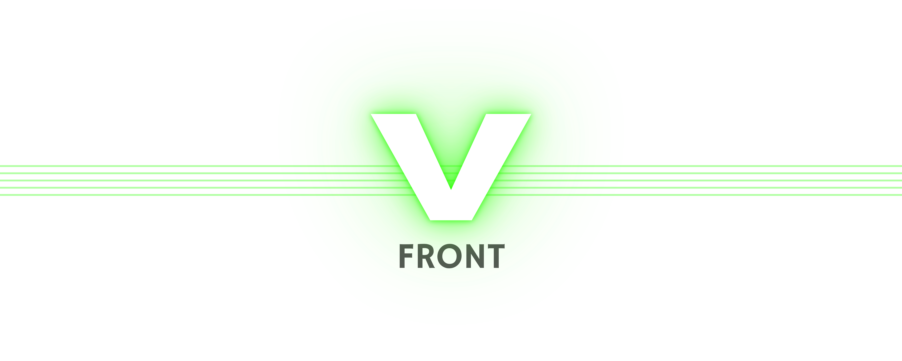

<picture>
  <source
    srcset="docs/v-front_darkbanner.png"
    media="(prefers-color-scheme: dark)"
  />
  <source
    srcset="docs/v-front_lightbanner.png"
    media="(prefers-color-scheme: light), (prefers-color-scheme: no-preference)"
  />
  
</picture>

**V-FRONT** is a **five**-stage, 32-bit RISC-**V** processor implemented in **V**erilog. It supports the base RISC-V ISA module RV32I, version 2.1.

### Summary

     

- RV32I (v2.1) compliant, with Zicsr and Zifencei extensions
- Five-stage von Neumann architecture
- 32 KB unified dual-port dual-clock BRAM-based memory (16 KB program, 16 KB data)
- CSR unit with 4096 CSR registers
- Handles misaligned memory accesses via trap vector `mtvec_handler`
- Fully tested with riscv-tests as of 2025-06-03

## Prerequisites

[RISC-V GNU Toolchain](https://github.com/riscv-collab/riscv-gnu-toolchain) needs to be installed on the host machine to run the unit tests, or just to compile a program for V-FRONT. Installation instructions can be found in its own [README.md](https://github.com/riscv-collab/riscv-gnu-toolchain/blob/master/README.md) file. Please use:
```bash
./configure --prefix=/opt/riscv --with-abi=ilp32 --with-arch=rv32i
```
while installing RISC-V GNU Toolchain, as this is the configuration required by V-FRONT. To run the unit tests, Icarus Verilog needs to be installed on the host machine. For this, run:
```bash
sudo apt install iverilog
```
The tests can be run using Vivado, as well. To download Vivado, please see AMD's [Downloads](https://www.xilinx.com/support/download.html) portal for Vivado Design Suite. To run the unit tests using Vivado, libraries `libncurses5` and `libtinfo5` are also required, which can be installed with:
```bash
sudo apt install libncurses5 libtinfo5
```

## Getting Started

To start working with V-FRONT, run:
```bash
git clone --recursive https://github.com/kagandikmen/V-FRONT.git
```
from your working directory. If you already cloned the repository without the `--recursive` option, use:
```bash
git submodule update --init --recursive
```
from inside the V-FRONT directory. To run the unit tests with Icarus Verilog, use:
```bash
make
```
after navigating into the V-FRONT directory. To run the tests using Vivado, run:
```bash
make run_vivado
```
In correct setup, the tests should all pass; there is no test failing as of 2025-06-03. To get rid of all the files generated during the tests, run:
```bash
make clean_all
```
Find an example of how a generic C file can be compiled to run on V-FRONT by navigating to [sw/test/](sw/test/). A Tcl script automatizing Vivado project generation is also offered with V-FRONT; for this, please refer to [vivado-setup/README.md](vivado-setup/README.md).

## Project Structure

- `.github` - GitHub Actions setup
- `docs/` - Project documentation and images
- `lib/` - Verilog libraries for constants and functions commonly used throughout the design
- `rtl/` - Verilog source code
- `sim/` - Verilog testbenches
- `sw/` - Software helpers such as trap vectors and linker scripts; also includes demo software
- `ut/` - Unit tests taken from [riscv-tests](https://github.com/riscv-software-src/riscv-tests)
- `vivado-setup/` - Helpers for easy setup on Vivado

## Architectural Details

V-FRONT implements a five-stage pipelined von Neumann CPU architecture. In its current configuration, it has a 32 KB unified memory to store both program and data, where the first 16 KB is reserved for programs and the second 16 KB for data. Misaligned accesses to this unified BRAM memory are allowed, where the CPU then raises an exception and jumps to a trap vector to handle the misaligned access.

V-FRONT implements 4096 CSR registers in its CSR unit. As of 2025-06-03, the only exception the hardware itself can raise is when a misaligned memory access is attempted. But software can raise any exception through `ecall` and `ebreak` instructions, where the program then jumps to the address stored in the CSR register `mtvec`.

V-FRONT implements `fence` and `fence_i` instructions as pure `NOP`s, as these instructions do not serve any meaningful purpose in a single-core setting.

V-FRONT has been tested for full RV32I compliance using the unit tests in the [ut](ut/) folder, which are sourced from [riscv-tests](https://github.com/riscv-software-src/riscv-tests), the official test suite provided by RISC-V International.

## Status

The unit tests all pass as of 2025-06-03. The design is fully synthesizable.

### Known Issues

- The five-stage pipeline is fully implemented and tested, but not optimized yet for performance. As a result, the current implementation runs at relatively low clock frequencies (below 20 MHz on Zynq 7020).

## Contributing

Pull requests, suggestions, and bug reports are all welcome.

## License

V-FRONT is licensed under MIT License. See [LICENSE](LICENSE) for details.

V-FRONT incorporates components and code from external sources. For detailed license and copyright information regarding these components, please refer to [NOTICE.md](NOTICE.md).

---